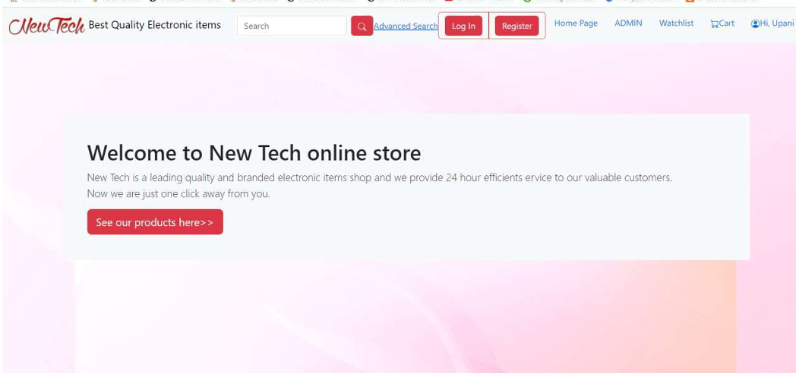
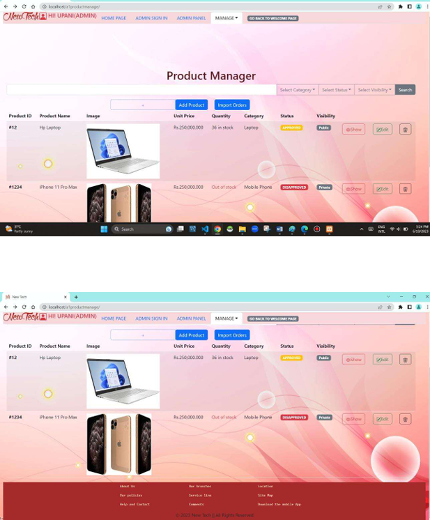

# MyShop-E-commerce-web-application-developed-using-PHP-JavaScript-HML-CSS-Bootstrap-
Web App

---

# 🚀 NewTech – Full-Stack E-Commerce Web Application

## 📌 Project Overview

**NewTech** is a fully functional, role-based **e-commerce web application** developed using **PHP, JavaScript, HTML, CSS, and Bootstrap**.

The system supports:

* 👤 Customer registration, login, and purchasing
* 🛍 Seller product management
* 🛠 Admin control panel
* 💳 Order processing and invoice generation
* 📩 Messaging system
* 🔐 Secure authentication workflows

The platform is currently running locally and demonstrates a complete end-to-end e-commerce workflow.

---

## 🏗 System Architecture

The project follows a structured modular PHP architecture:

* **Frontend:** HTML5, CSS3, Bootstrap, JavaScript
* **Backend:** PHP (process-based structure)
* **Database Connectivity:** Centralized `connection.php`
* **Authentication System:** Role-based (Admin / Seller / Customer)
* **Email Handling:** PHPMailer integration
* **Payment Processing:** Payment workflow integration
* **Invoice Generation:** Automated invoice handling (`invoice.php`, `pdfprocess.php`)

Each feature is separated into:

* UI pages
* Corresponding process handlers (`*Process.php`)
  This ensures clean separation of logic and maintainability.

---

## 🔥 Key Features

### 👤 User Management

* User registration & login
* Password reset & verification
* Profile update
* User blocking system (Admin)
* Role-based access control

### 🛍 Product Management

* Add / Update / Delete products
* Product listing & filtering
* Advanced search functionality
* Category/Brand/Model loading dynamically
* Seller-specific product management

### 🛒 Shopping System

* Add to cart / Remove from cart
* Watchlist feature
* Purchase flow
* Invoice generation
* Purchase history tracking

### 🧾 Order & Invoice System

* Invoice creation
* Invoice status management
* PDF processing
* Selling history tracking

### 💬 Communication System

* User messaging
* Admin messaging
* Message management workflows

### 🔎 Advanced Search Engine

* Basic search
* Advanced multi-parameter search
* Sorting mechanisms

---

## 🔐 Security & Validation

* Session-based authentication
* Role validation
* Input processing via separate handlers
* Email verification flows
* Password recovery system
* Structured process-based request handling

---

## 🛠 Technologies Used

* PHP
* JavaScript
* HTML5
* CSS3
* Bootstrap
* MySQL
* PHPMailer
* AJAX-based dynamic loading
* Modular file architecture

---

## 📂 Project Structure Highlights

* `adminPanel.php` – Admin control system
* `manageUsers.php` – User management
* `manageProduct.php` – Product control
* `cart.php` – Shopping cart system
* `invoice.php` – Invoice handling
* `advancedSearch.php` – Multi-parameter search
* `connection.php` – Central DB connection
* `*Process.php` – Backend logic separation

The architecture demonstrates real-world separation of concerns and scalable design principles.

---

## 🎥 Demo

## 💡 What This Project Demonstrates

This project reflects:

* Full-stack development capability
* Database-driven application design
* Role-based system architecture
* Modular backend implementation
* Real-world e-commerce workflow understanding
* Clean separation of business logic
* Practical system integration skills

---

## 👨‍💻 Developer

**Upani Gunathunga**

---

